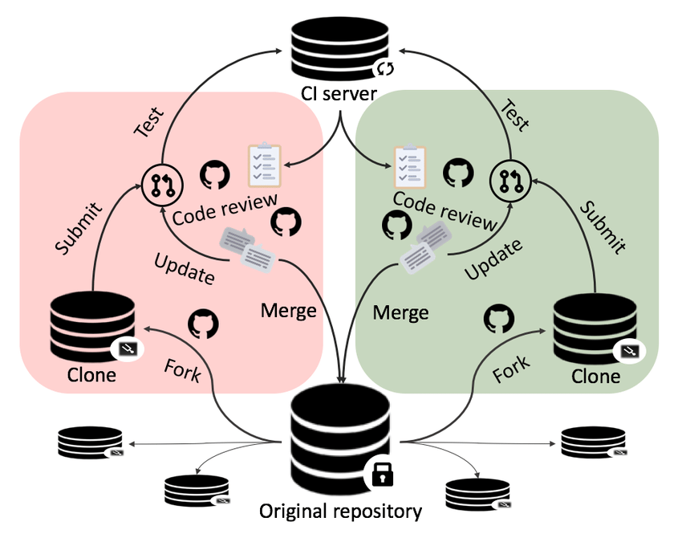
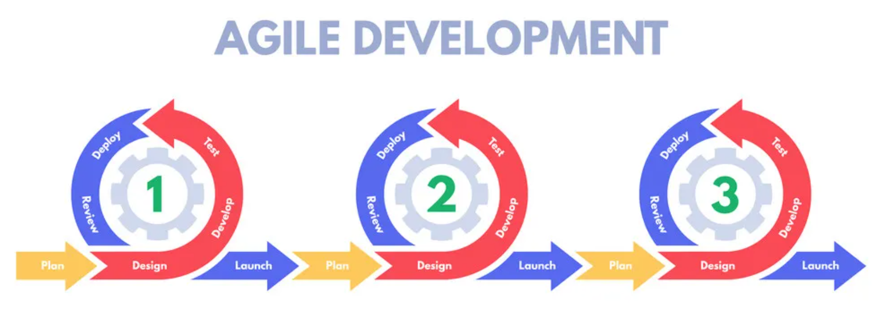

# Git, GitHub与项目管理层面的敏捷开发 [文字稿]

## 前言

- 💡 基本使用VSC的傻瓜式git操作: 希望通过今天的演示能让大家不再觉得git是个充满神秘感的难以操纵的工具. 另外为了方便大家理解git, 也会涉及一点git的内部原理. 很多时候几条git命令可以实现相同的效果, 我演示的操作不一定是最正确的方式, 但是是我觉得最省事的方式. 大家有什么疑惑随时提出来.
- 实际上我们普通git使用者需要知道的git命令很少, 在[Git Reference-giteveryday](https://git-scm.com/docs/giteveryday)有列出四类git使用者所需要知道的git命令, 能看到一个只单机的个人开发者即便只使用命令行, 会用到的git命令并没有几条.

## 用到的工具

- Visual Studio Code
  - Gitlens插件
  - Git Graph插件
  - Conventional Commits插件
- Github Desktop
- zsh
  - [Oh My Zsh](https://ohmyz.sh/#install)配置框架
  - [p10k主题](https://github.com/romkatv/powerlevel10k)
- neovim (我的配置在[这里](https://github.com/LeoJhonSong/vimrc), README很久没更新了)
- chrome
  - [ZenHub](https://www.zenhub.com/extension)插件
  - [Octotree](https://www.octotree.io/)插件
- screenkey

## 推荐资料

- [Git Book](https://git-scm.com/book/en/v2) (可以关键词搜索)
- [Github官方文档中的快速入门](https://docs.github.com/en/get-started/quickstart/hello-world)

不吃安利也没关系, 我们接下来会复用这两份文档的一些内容.

## 演示内容

### 配置git与拉取代码

`--global`配置email, name (我喜欢用主机名, 每个机器不一样), [http凭证助手](https://git-scm.com/book/en/v2/Git-Tools-Credential-Storage) 💡不给值的话能看到当前值

```sh
git config --global credential.helper store # 将凭证以明文形式永久储存在~/.git-credentials
```

配置到哪里去了? `~/.gitconfig`. 打开Git Book搜**config**指出git查找配置值的顺序. 一会会看到`--local`仓库级配置文件会在哪里.

用Github Desktop把**VCPM-demo**拉下来, 改远程段名字为**VCPM-Salon**, Github Desktop自动给改远程端链接 (所以还是有一些贴心细节的). Github Desktop的好处在于**能同时看到多个仓库的状态**, 免得忘记是不是有仓库有提交没有上传 (也有一些付费软件能做到功能很丰富, 但Github Desktop是免费的).

接下来我们拉一个大仓库下来试一试git的操作. 首先把[uestc-msc](https://github.com/uestc-msc)下的vscode仓库fork到自己帐号下.

> 这里要指出fork不是收藏夹功能, 想收藏项目的话用star, 现在star已经支持自建多个收藏夹了. 看了维基词条[Fork (software development)](https://en.wikipedia.org/wiki/Fork_(software_development)#:~:text=Sites%20such%20as%20GitHub%2C%20Bitbucket,of%20contribution%20to%20a%20project.)就能发现这个"fork"和叉子没关系, 中文翻译是**分叉**, 这个正统的用途可以大概理解为二次创作. 比如谷歌搜索**neovim**能看到描述直接写着Vim-fork, 点进neovim->Wiki->Introduction能看到neovim项目诞生的缘由.
>
> 我们这里把微软的vscode的仓库分叉到俱乐部的仓库也是类似的原因: 在避免影响到上游的情况下对代码做一些改动. 人话就是我没有改动微软的vscode仓库的权限. 至于为什么再把俱乐部的vscode仓库fork到自己帐号, 一会就知道了😁

然后我们用https协议浅克隆最后50个提交到自己帐号这个vscode的主分支到**VCPM-demo**根目录的**test-repo**文件夹

```sh
git clone --depth 50 --single-branch https://github.com/LeoJhonSong/vscode.git test-repo
```

这时会发现克隆还是很慢, 这是因为Github在墙外. git不会从环境继承代理, 需要手动指定 (刚刚用客户端快是因为**VCPM-Salon**仓库很小):

```sh
git config --global http.proxy http://127.0.0.1:7890
```

💡要注意这样设置只能代理http/https协议的克隆, ssh协议的克隆需要在ssh的配置文件进行代理设置 (比较麻烦). 以我的经验来看即便都不代理ssh协议克隆得也比https协议克隆得慢, 而且ssh协议克隆需要提前在远程端上传ssh公钥, 所以我更推荐https协议克隆.

之所以只浅克隆主分支, 是想过滤掉不太相关的信息 (同时下载大小小很多速度会快很多). 我试过完整克隆这个仓库会下载**476.36MB**, 而可以看到现在只需要下载**14.88MB**. 而且可以看到这个仓库原本有五百多个分支, 现在我们只下了一个分支的最新50个提交. 一种很常见的使用场景是: 我们想下一个东西来用, 这个项目是在Github之类平台进行代码托管的. 如果我们想下git的最新版而不是这个项目官方的 release, 并且保留拉取更新的功能, 那么就可以在克隆的时候指定depth为1. 如果想要看更多前面的提交, 用`git fetch --deepen=<depth>`, 或者直接转成完整分支`git fetch --unshallow`. 如果想拉取其他分支, `git remote set-branches --add origin <branch>`添加远程端的分支 (随便找个分支添加上). 另外也可以添加其他的远程端, 实现比如提交同时上传到Github和Gitee的操作.

打开dolphin全选所有文件删除掉, 然后命令行输`git checkout HEAD`撤回删除. <kbd>Ctrl H</kbd>显示出隐藏文件, 能看到多出了一个`.git`文件夹, 实际上这才是一个git仓库的本体, 刚刚被删掉的所有文件都是从这个文件夹中提取出来的, 只要`.git`文件夹还在, 版本历史就不会丢. 💡这里说的版本历史是所有提交过的东西, 不管是被删掉的分支还是被覆盖的提交其实[都能恢复](https://git-scm.com/book/en/v2/ch00/_data_recovery) (但没提交过的更改真恢复不了). 点开这个文件夹能看到有个`config`文件, 这个`.git/config`就是刚刚提到的`--local`所对应的仓库级配置文件.打开能发现这个文件的可读性非常强, 能看到有我们刚刚添加的远程分支等信息, 其实完全可以通过直接编辑配置文件的方式来设定git配置.

### 浏览代码

💡在**VCPM-demo**打开vsc

在git仓库里是可以存在git仓库的, (打开终端) 能看到在**VCPM-salon**仓库的master分支, 进入vscode文件夹能看到进入了**vscode**仓库的main分支. 好了, 一开始就说过我是想展示基本使用VSC图形界面的傻瓜式VSC操作的, 现在我们就来看看VSC里怎么进行git操作. 不过这里有一个小小的bug我们需要先解决一下. VSC会递归查找并显示工作区中所有git仓库, 不过默认递归深度是1, 就是说只计入根目录下的所有git仓库. 但这里有一个bug: [当根目录本身就是一个git仓库时子目录中的git仓库无法被显示](https://github.com/microsoft/vscode/issues/37947). 比较省事的临时解决办法是将想看的子目录中的git仓库添加为根目录git仓库的git子模块. 具体到我们这里: 

```sh
git submodule add https://github.com/LeoJhonSong/vscode.git vscode
```

💡这不是git submodule的正经用法, 实际上通过`git submodule add`命令就可以将vscode仓库拉取下来, 当在指定位置不存在这个子模块时git就会从链接克隆仓库, 通过给类似的参数也可以只拉取指定分支的浅克隆. 我们这里对git子模块不多做介绍, 想了解的话可以看看[Git Book中对submodule的说明](https://git-scm.com/book/en/v2/Git-Tools-Submodules).

> 如果你要问我为什么要把vscode克隆到这里, 我只是想展示在工作区有多个git仓库的时候的情况, 没什么特别用意😁

好了! 我们终于可以开始在VSC里点点点了. 切换到源控制面板, 在**SOURCE CONTROL**一栏下能看到所有被vscode计入的git仓库的状态. 点**vscode**旁边的main, 就可以切换vscode仓库的分支了. 切换仓库的时候VSC到底做了什么呢? 在`OUTPUT-Git`可以看到VSC执行的git命令 (只显示VSC内置git模块进行的操作), 因为我VSC开了`git.autofetch`选项所以VSC时不时就会去刷新一下. 可以看到分支切换是用`git checkout`命令实现的. 这个命令不止可以切换分支, 其实可以按提交的哈希值前几位直接切换到任意分支的任意commit, 也可以按tag切换到指定提交.

> 随便用diff模式, blame模式看看最近的提交内容. 以及file history. 比如看看`src/main.js`. 会发现提交历史不多, 想多看点又不想下完整分支的话可以先去Github看看file history然后`git fetch --shallow-since "1 year ago"`. 然后是Git Graph

### 编辑代码

#### 基本操作

##### add, commit, push

> 随便编辑几个文件
>
> - 随便增改个文件
> - 新建hello.txt随便打个hello world
> - 重命名main.js为mymain.js, 把所有`const`替换为`c`. 演示后把310行后内容删掉 (对于有大量内容变化的重命名文件, 想保留文件历史的解决办法是分两次提交)

M, R, D, U (添加到暂存区后变成A) 分别是什么. git三连: add, commit, push.

回过头来看看为什么要分为三步.

- 其实借助VSC的`git.enableSmartCommit`和`git.postCommitCommand`确实是可以一键三连的.
- add和commit分离是很好理解的: add命令将更改分为已暂存和未暂存的, 这样可以把更改分成几个目的更明确的提交, 或者是储藏起来之类的. 而把commit和push分开是为了把本地和远程端分离开, 不需要协作的内容就保留在本地就好.
- 随便改点什么然后Commit (Amend), 再次一键三连. 会发现出错了. 此时需要force push. 如果对已有commit做了改动哈希值就会变. Github上可以把仓库设置为禁止force push, 或者在公共分支上你也不应该force push, 那这些情况下push什么东西就要稍微注意点了. 在公共分支上想对已有提交改动正确操作是用revert.

💡刚刚有提过**只要提交过的东西都能找回**, 因此hard reset撤销的提交仍然能在本地找回, 怎么操作这里不展开. 其实我觉得个人仓库或者个人分支确实没必要把commit和push分开, 有问题force push就完事(我用得其实很频繁).

补充: 有一些更改在VSC的diff窗口看不出区别, 比如只改动这个文件的权限`chmod a+x README.md`. 此时想看出到底什么变了可以用`git diff`. 💡Git中**文件**的合法模式只有`100644` (普通文件), `100755` (可执行文件), `120000` (软链接) 三种 (另有表示目录和子模块的模式).

##### .gitignore

**递归, 有顺序的**

语法概要:
- `#`开头为注释 (不支持行末注释)
- 可以用标准glob模式匹配, 会递归应用到整个工作区
  - `*`匹配0或多个字符
  - `**`匹配嵌套目录. e.g. `a/**/z`
- `/`开头限制仅匹配当前目录下的, 禁止递归
- `/`结尾指定为目录: `build/`不会匹配名为build的文件
- `!`开头强制不忽略此模式

💡.gitignore也可以当白名单用.

```sh
# 建个test文件夹并初始化成git仓库, 打开
mkdir test; cd test; git init; code .
# 建一些文件
.
├── my_module
│   ├── .gitignore # 后建
│   ├── __init__.py
│   └── sub_module
│       ├── .gitignore # 后建
│       └── m.py
└── test.py
```

```sh
# 当黑名单用
__pycache__

# 当白名单用 (一行一行填, 展示区别)
# my_module/.gitignore
*
!.gitignore
!*/
!__init__.py
# my_module/sub_module/.gitignore
!*.py
```

##### 临时储存更改

只有更改有冲突时更改会被checkout覆盖. 编辑README.md切换/打开Git Graph找一个main比另一个分支新的提交里的文件编辑一下然后切换, 会发现切换不动. 此时不想更改丢失又想切换到另一个分支看看的话, 用**stash**临时储存一下这些更改, 看完回来又可以再弹出这些更改.💡stash也可以用来比较保险地清理更改.

#### 良好的提交说明

演示一下用Conventional Commits插件提交 (记得填**close #1**). 格式化提交信息的意义在于以填表的形式快速给出一个提交中最需要我们关注的信息, 方便维护. 一会能看到这个**close #1**的效果.

#### 重写历史

**这实际上是rebase的一种特殊用法**, 很常用但是并不能很好地体现rebase为什么叫rebase. 从[Git文档](https://git-scm.com/docs/git-rebase#_interactive_mode)的描述能看出rebase交互模式主要用来除掉两种提交:
1. 已有很多日常提交但这些提交目的划分得不够明确
2. 有用来修复自己在开发中的分支里引入的bug的提交

`git rebase -i HEAD~5`看一眼默认编辑器 (vim) 会触发的界面. 然后将流编辑器设置为VSC, 就可以比较图形界面地进行历史重写了. 

```sh
git config --global sequence.editor "code --wait"
```

可以看到Gitlens插件提供的这个图形界面少了一些命令, 不过已经包含了所有普通操作 (其他几个命令我还没用过). reward最早的提交, fixup后面所有提交演示一下什么是一提交超人.

#### 标记大版本

直接右键**COMMITS**一栏下想标记的提交就可以创建标签, 或者点**TAGS**这栏的加号. 标签主要是指示出阶段性版本, 进一步方便我们在众多提交中找到想要的信息 (比如写课设的时候可以在每次写完一个任务的提交处标记一下).

### Github仓库介绍

> #### web VSC
>
> 打开一个Github仓库的页面按一下<kbd>.</kbd>就可以打开web VSC. 想要临时编辑一下, 传点文件或者在本地没有克隆的情况下给一个仓库提PR (比如就改点拼写错误之类)的时候还是很方便的.

#### 主要页面

因为vscode仓库的工作流有点复杂, 我们以稍微简单一些但我觉得也十分规范的[cyberbotics/webots](https://github.com/cyberbotics/webots)这个项目为例来看看内容比较全的活跃的开源项目都会有些什么. 下面给大家简单介绍几个有用页面.

1. Code
   - 选择topic查看相关热门项目
   - README有最需要知道的一些信息 (有TOC)
   - 点进Releases->R2022a-> (在新的页面打开) complete change log, 能看到一项对应一个issue, 且按照用途分类.
2. Wiki: 轻量级文档托管
3. [Issues](https://docs.github.com/en/issues/tracking-your-work-with-issues/about-issues) 轻量级问题跟踪系统. 不过说问题其实不是很准确, 可以看到Github将Issues翻译为议题, 一个想法/反馈/任务/bug等等都可以被称为一个issue. 我在网上看到说Issues是从工单系统发展出来的, 但要我说的话之所以这东西不叫工单系统是因为这里不存在客户. 在开源社区中什么事情都是讨论着来的. 经典案例: 点开我的关于tab长度bug的issue. "这是feature", "please go ahead and implement it"
4. Discussions: 讨论区/简易论坛. Issues里不适合水的内容可以在这里, 但也没有严格规定.
5. Pull requests (一会具体使用)
6. Settings
   - General-Features选择开启的功能, 看看[microsoft/vscode](https://github.com/microsoft/vscode)的issue模板.
   - General-Pull Requests开启自动删除已合并分支
   - Github Pages在单独的Pages页设置

#### 怎么防止队友把仓库炸了?

1. 限制队友权限: **Collaborators and teams**下组织的BASE ROLE为Write, (不要给组织的所有者权限). 或者BASE ROLE为Read, DIRECT ACCESS给Write (多了push和审计)
2. **Branches**下设置分支保护 (禁止force push但偷偷给自己force push权限). 如果队友代码实在写得很烂, 甚至禁止队友向master分支推送提交, 只允许队友以PR的方式向主分支合并提交, 且必须有至少一人批准. 这样就可以防止队友往项目倒垃圾了.

#### 队友已经把仓库炸了怎么办?

- 你有完整克隆 (运行过git pull和远程端变成了相同状态也算): 直接修复本地克隆并`git push -f`覆盖有问题的分支
- 谁都没有完整克隆: 通过Github的API从Github远程仓库获取丢失的提交. 具体怎么做这里不展开, 有兴趣可以看看[这个](https://gist.github.com/fracz/b4a70b3ec195015cfb6aab5ef8fdb754)

##### 浅探Git内部原理: 为什么在git中能这么容易地恢复数据?

- [一个简单Git数据库的例子图示](https://git-scm.com/book/en/v2/Git-Internals-Git-References)

- 以**VCPM-demo**举例

  ```sh
  cd .git
  tmux # 然后上下分屏, 上面放ranger
  # Git的核心部分: HEAD (当前被检出的分支), index (暂存区信息), objects (Git数据库), refs (指向分支/远程仓库的分支/标签的提交对象的指针)
  cat HEAD # 当前被检出的分支
  cat refs/heads/master # 
  # objects/19/5a2bf09643dfd9a18a61805a15957d0bd681ef是一个zlib压缩文件
  git cat-file -p 195a2bf
  ```

**Git中保存的并不是文件的差异**, 而是一系列不同时刻的快照, 人话就是每次提交的时候的完整文件, 不过也并不是每次提交就把整个工程复制出来这么简单粗暴. Git数据库中有三种对象: blob object (数据对象), tree object (树对象), commit object (提交对象). Git是用一种简化版UNIX文件系统的机制来储存内容的, 树对象对应UNIX的目录项, 数据对象是inodes/文件内容. 一个树对象包含多条记录, 每条记录里有一个指向数据对象或着子树对象的哈希值 (这个值被当成指针用), 然后某时刻仓库里的文件树就可以[这样](https://git-scm.com/book/en/v2/Git-Internals-Git-Objects)表示出来了. 所有新添加或者有过更改的文件会作为一个数据对象被存到git的数据库里, 也就是`.git/objects`下. 而一次提交里没有变动的文件被记录的时候就会直接沿用这个文件已有的数据对象的指针. 但即便这样, 只要文件有一点修改也会被Git存成一个新的数据对象, 还是很浪费空间. Git会在对象比较多时将同一个文件的不同版本的这些数据对象打包, 最新的版本以完整版本保存, 其他版本都是以差异的形式保存的. 打包也可以手动执行, 向远程端推送的时候也会打包. 这就比较符合我们的想法了.

Git采用的这种方式有挺多优势, 我挑一个我知道的说说: **快**. 需要切换到另一个分支上的时候不需要层层打补丁, 只需要HEAD指向另一个分支的提交, 然后Git从数据库取出文件就好了.

那对于Git的机制我们就有一个非常粗浅的了解了.  所以我们刚才用到以及接下来会用到的Git操作只有向Git数据库写入数据, 不会删除任何东西. 因此不管怎样总是能有办法恢复数据的.

### Github flow开发工作流

更传统, 重型的[Git flow](https://nvie.com/posts/a-successful-git-branching-model/). 此处不详细展开, 有兴趣可以看看这篇很详细的文章.

[Github Flow官方文档存档](https://web.archive.org/web/20211102140758/https://guides.github.com/introduction/flow/)




工作流赏析:

- webots使用[丐版Git flow](https://github.com/cyberbotics/webots/wiki/Git-workflow/)
- [vscode仓库](https://github.com/microsoft/vscode/releases)将feature milestone中PR合并到main, recovery milestone里的合并到release/x.xx分支. 升级版Github flow

**越轻量级, 应当使用越简单的分支模型.**

### Pull requst管理

先用[这个PR](https://github.com/cyberbotics/webots/pull/3499)展示一下:

- PR是干什么的
- 良好的PR会是怎样的
- PR的流程: 草稿, [状态检查](https://docs.github.com/en/pull-requests/collaborating-with-pull-requests/collaborating-on-repositories-with-code-quality-features/about-status-checks) (Github Action), 与审阅者讨论 ([建议更改](https://docs.github.com/en/pull-requests/collaborating-with-pull-requests/reviewing-changes-in-pull-requests/incorporating-feedback-in-your-pull-request)之类的), (多轮修改和测试), 合并, 删除PR分支
- [合并的具体方式](https://docs.github.com/en/repositories/configuring-branches-and-merges-in-your-repository/configuring-pull-request-merges/about-merge-methods-on-github): (可以在[Settings](https://github.com/uestc-msc/vscode/settings)-Pull Requests中设置)
  - basic merging 三方合并 (默认no fast forward, 最推荐)
  - squash merging ==不可以在公共分支强制推送==
  - rebase merging, 此rebase与[git中rebase]((https://git-scm.com/book/en/v2/Git-Branching-Rebasing))不完全一样, 始终会创建新的提交, 我认为这其实是批量cherry-pick (能保证线性提交历史, 但丢失了分支信息, 不推荐)


借助vscode仓库简单介绍下Github Action

### 敏捷开发的项目管理简介

vscode仓库使用Github原生项目管理支持.

敏捷开发要点:

- 迭代开发
- 增量式开发

有兴趣可以了解下敏捷开发的十二条原则 (虽然我并不记得几条)



扩展阅读: [Github与Zenhub助力敏捷](https://blog.zenhub.com/how-to-use-github-agile-project-management/amp/)
